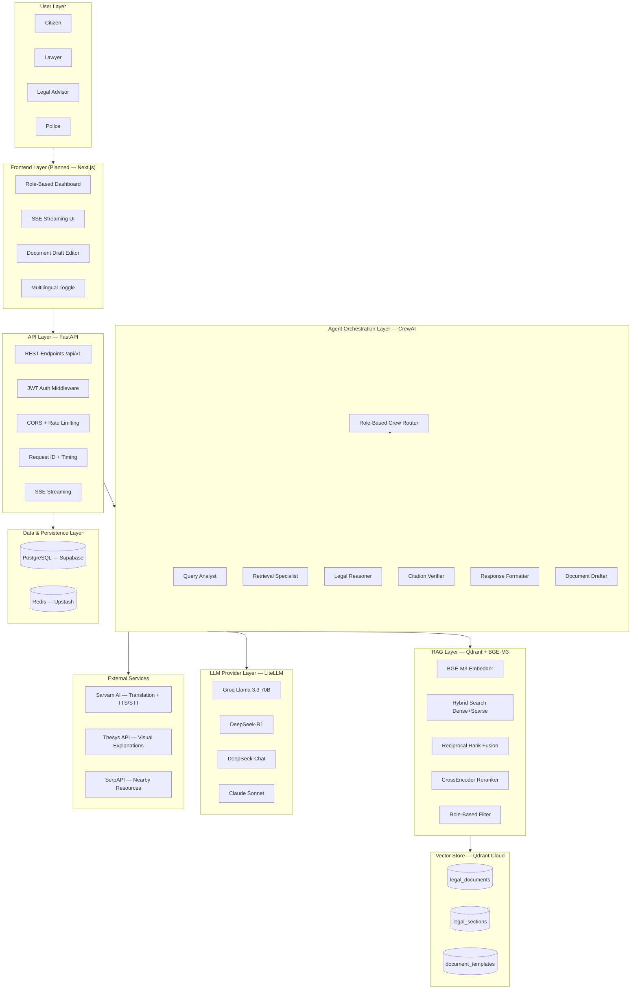

# System Layer Architecture

High-level stack of Neethi AI — organized by functional layer.

---

## Layer Responsibilities

| Layer | Technology | Responsibility |
|---|---|---|
| User | Browser / Mobile | Role-based interface access |
| Frontend | Next.js (planned) | SSR dashboard, streaming UI, drafts |
| API | FastAPI + Uvicorn | Auth, routing, middleware, SSE |
| Agent Orchestration | CrewAI | Sequential multi-agent legal reasoning |
| RAG | Qdrant + BGE-M3 | Hybrid retrieval, reranking, filtering |
| Vector Store | Qdrant Cloud | Dense + sparse vector storage |
| LLM Providers | Groq / DeepSeek / Anthropic | Classification, reasoning, verification |
| Persistence | PostgreSQL + Redis | Users, sessions, caching |
| External Services | Sarvam / Thesys / SerpAPI | Translation, visuals, discovery |
