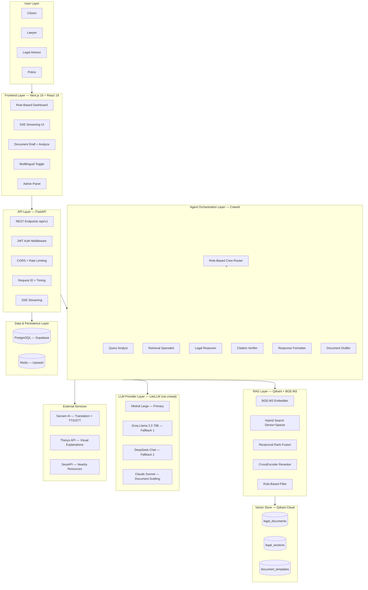

# System Layer Architecture

High-level stack of Neethi AI — organized by functional layer.

```mermaid
graph TB
    subgraph USER["User Layer"]
        U1[Citizen]
        U2[Lawyer]
        U3[Legal Advisor]
        U4[Police]
    end

    subgraph FRONTEND["Frontend Layer — Next.js 16 + React 19"]
        FE1[Role-Based Dashboard]
        FE2[SSE Streaming UI]
        FE3[Document Draft + Analyze]
        FE4[Multilingual Toggle]
        FE5[Admin Panel]
    end

    subgraph API["API Layer — FastAPI"]
        API1[REST Endpoints /api/v1]
        API2[JWT Auth Middleware]
        API3[CORS + Rate Limiting]
        API4[Request ID + Timing]
        API5[SSE Streaming]
    end

    subgraph AGENT["Agent Orchestration Layer — CrewAI"]
        AG1[Query Analyst]
        AG2[Retrieval Specialist]
        AG3[Legal Reasoner]
        AG4[Citation Verifier]
        AG5[Response Formatter]
        AG6[Document Drafter]
        ROUTER[Role-Based Crew Router]
    end

    subgraph RAG["RAG Layer — Qdrant + BGE-M3"]
        RAG1[BGE-M3 Embedder]
        RAG2[Hybrid Search Dense+Sparse]
        RAG3[Reciprocal Rank Fusion]
        RAG4[CrossEncoder Reranker]
        RAG5[Role-Based Filter]
    end

    subgraph VECTOR["Vector Store — Qdrant Cloud"]
        VDB1[(legal_documents)]
        VDB2[(legal_sections)]
        VDB3[(document_templates)]
    end

    subgraph LLM["LLM Provider Layer — LiteLLM (via crewai)"]
        LLM0[Mistral Large — Primary]
        LLM1[Groq Llama 3.3 70B — Fallback 1]
        LLM2[DeepSeek-Chat — Fallback 2]
        LLM3[Claude Sonnet — Document Drafting]
    end

    subgraph DATA["Data & Persistence Layer"]
        DB1[(PostgreSQL — Supabase)]
        CACHE1[(Redis — Upstash)]
    end

    subgraph EXTERNAL["External Services"]
        EXT1[Sarvam AI — Translation + TTS/STT]
        EXT2[Thesys API — Visual Explanations]
        EXT3[SerpAPI — Nearby Resources]
    end

    USER --> FRONTEND
    FRONTEND --> API
    API --> AGENT
    ROUTER --> AGENT
    AGENT --> RAG
    AGENT --> LLM
    RAG --> VECTOR
    API --> DATA
    AGENT --> EXTERNAL
```

---

## Layer Responsibilities

| Layer | Technology | Version | Responsibility |
|---|---|---|---|
| User | Browser / Mobile | — | Role-based interface access |
| Frontend | Next.js + React | 16.1.6 / 19.2.3 | SSR dashboard, SSE streaming, drafts, admin |
| API | FastAPI + Uvicorn | 0.115.6 / 0.34.0 | Auth, routing, middleware, SSE |
| Agent Orchestration | CrewAI | 1.11.0 | Sequential multi-agent legal reasoning |
| RAG | Qdrant + BGE-M3 | client 1.12.0 / FlagEmbedding 1.3.5 | Hybrid retrieval, reranking, filtering |
| Vector Store | Qdrant Cloud | — | Dense 1024d + sparse BM25 vector storage |
| LLM Providers | Mistral / Groq / DeepSeek / Anthropic | via LiteLLM | Classification, reasoning, verification, drafting |
| Persistence | PostgreSQL + Redis | SQLAlchemy 2.0.36 / redis 5.2.1 | Users, sessions, caching |
| External Services | Sarvam / Thesys / SerpAPI / PageIndex | — | Translation, visuals, discovery, RAG |
