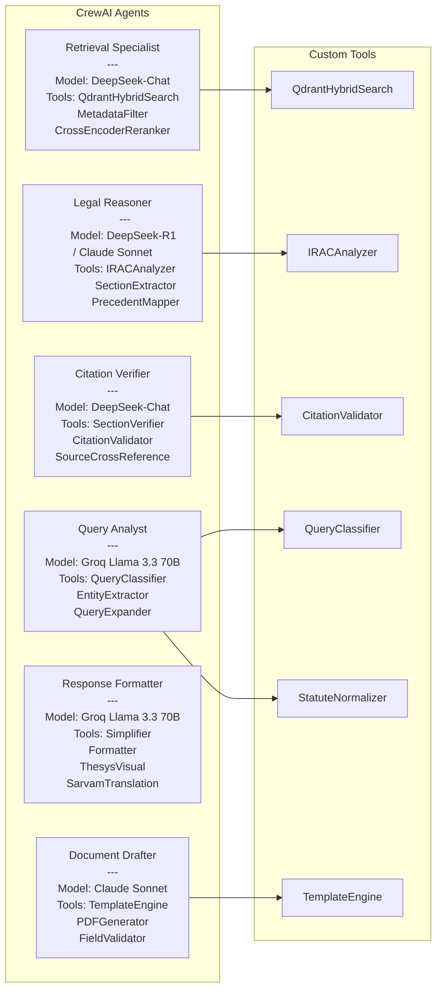
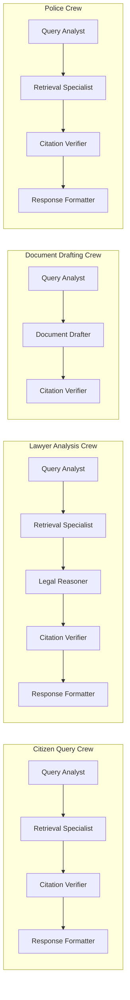
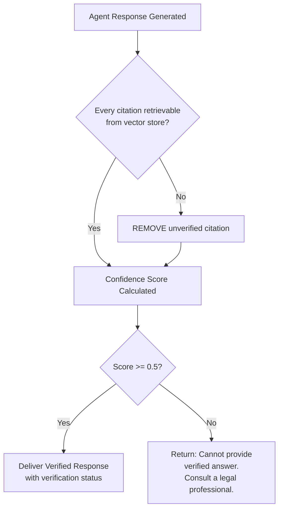

# Multi-Agent System Components

CrewAI agent composition and crew configurations per user role.

## Agent Components

```mermaid
graph LR
    subgraph AGENTS["CrewAI Agents"]
        QA["Query Analyst
        ---
        Model: Groq Llama 3.3 70B
        Tools: QueryClassifier
               EntityExtractor
               QueryExpander"]

        RS["Retrieval Specialist
        ---
        Model: DeepSeek-Chat
        Tools: QdrantHybridSearch
               MetadataFilter
               CrossEncoderReranker"]

        LR["Legal Reasoner
        ---
        Model: DeepSeek-R1 / Claude Sonnet
        Tools: IRACAnalyzer
               SectionExtractor
               PrecedentMapper"]

        CV["Citation Verifier
        ---
        Model: DeepSeek-Chat
        Tools: SectionVerifier
               CitationValidator
               SourceCrossReference"]

        RF["Response Formatter
        ---
        Model: Groq Llama 3.3 70B
        Tools: Simplifier
               Formatter
               ThesysVisual
               SarvamTranslation"]

        DD["Document Drafter
        ---
        Model: Claude Sonnet
        Tools: TemplateEngine
               PDFGenerator
               FieldValidator"]
    end

    subgraph TOOLS["Custom Tools"]
        T1[QdrantHybridSearch]
        T2[IRACAnalyzer]
        T3[CitationValidator]
        T4[QueryClassifier]
        T5[StatuteNormalizer]
        T6[TemplateEngine]
    end

    RS --> T1
    LR --> T2
    CV --> T3
    QA --> T4
    QA --> T5
    DD --> T6
```

---

## Crew Pipelines by Role

```mermaid
graph LR
    subgraph CITIZEN["Citizen Query Crew"]
        C1[Query Analyst] --> C2[Retrieval Specialist]
        C2 --> C3[Citation Verifier]
        C3 --> C4[Response Formatter]
    end

    subgraph LAWYER["Lawyer Analysis Crew"]
        L1[Query Analyst] --> L2[Retrieval Specialist]
        L2 --> L3[Legal Reasoner]
        L3 --> L4[Citation Verifier]
        L4 --> L5[Response Formatter]
    end

    subgraph DRAFT["Document Drafting Crew"]
        D1[Query Analyst] --> D2[Document Drafter]
        D2 --> D3[Citation Verifier]
    end

    subgraph POLICE["Police Crew"]
        P1[Query Analyst] --> P2[Retrieval Specialist]
        P2 --> P3[Citation Verifier]
        P3 --> P4[Response Formatter]
    end
```

---

## Citation Verification Rule

```mermaid
flowchart TD
    A[Agent Response Generated] --> B{Every citation retrievable\nfrom vector store?}
    B -- Yes --> C[Confidence Score Calculated]
    B -- No --> D[REMOVE unverified citation]
    D --> C
    C --> E{Score >= 0.5?}
    E -- Yes --> F[Deliver Verified Response\nwith verification status]
    E -- No --> G[Return: Cannot provide\nverified answer.\nConsult a legal professional.]
```
