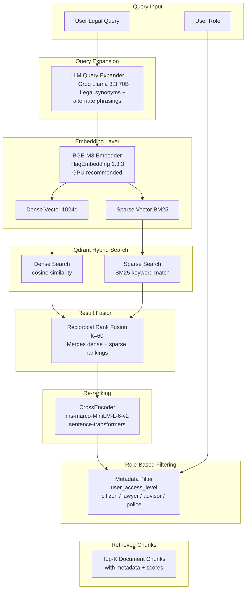
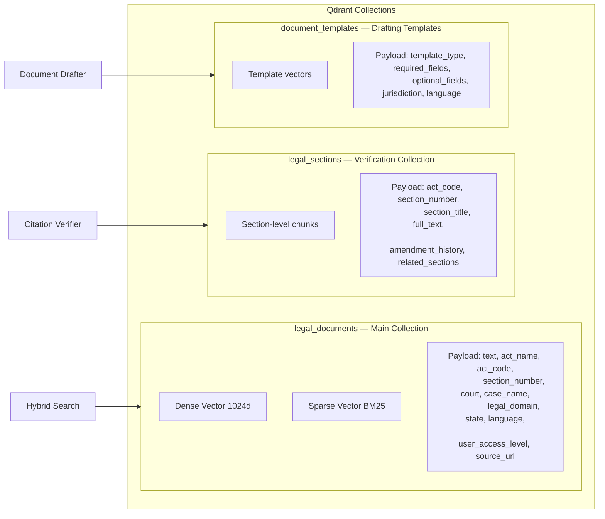

# RAG Pipeline Components

Retrieval-Augmented Generation architecture using Qdrant hybrid search.

## Retrieval Pipeline Components

---

## Qdrant Collections

---

## Embedding Strategy

| Dimension | Type | Use |
|---|---|---|
| Dense 1024d | BGE-M3 | Semantic similarity |
| Sparse BM25 | BGE-M3 | Keyword exact match |
| Scalar INT8 | Quantization | Memory optimization |

**Why BGE-M3?**
- Single model pass generates both dense and sparse vectors
- Outperforms separate dense + BM25 pipeline on legal queries
- Handles multilingual text (Hindi, English, mixed)
- See `docs/embedding_model_comparison.md` for evaluation details
