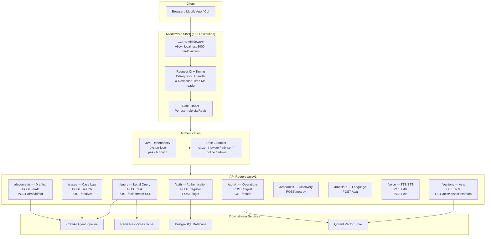
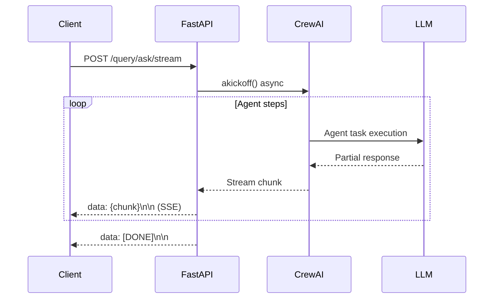

# API Routing Architecture

FastAPI layer — middleware stack, authentication, and endpoint organization.

## Middleware Stack



---

## Endpoint Access Matrix

| Endpoint Group | Citizen | Lawyer | Advisor | Police | Admin |
|---|---|---|---|---|---|
| `/auth` | Yes | Yes | Yes | Yes | Yes |
| `/query/ask` | Simplified | Full IRAC | Corporate | Procedural | Yes |
| `/query/ask/stream` | Yes | Yes | Yes | Yes | Yes |
| `/cases/search` | Read-only | Full | Full | Criminal | Yes |
| `/cases/analyze` | No | Yes | Yes | Limited | Yes |
| `/documents/draft` | Basic | Full | Full | Basic | Yes |
| `/sections` | Yes | Yes | Yes | Yes | Yes |
| `/resources/nearby` | Yes | Yes | Yes | Yes | Yes |
| `/translate` | Yes | Yes | Yes | Yes | Yes |
| `/voice` | Yes | Yes | Yes | Yes | Yes |
| `/admin` | No | No | No | No | Yes |

---

## SSE Streaming Response Format



---

## Application Entry Point

```
backend/main.py
├── Lifespan: DB table creation + Redis warmup
├── Middleware: CORS → Request ID → Rate Limit
└── Routers: auth, query, cases, documents, sections,
             resources, translate, voice, admin
```

Start command:
```bash
uvicorn backend.main:app --host 0.0.0.0 --port 8000 --loop asyncio
```
