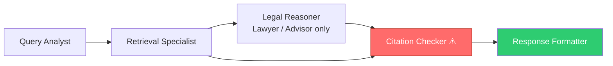
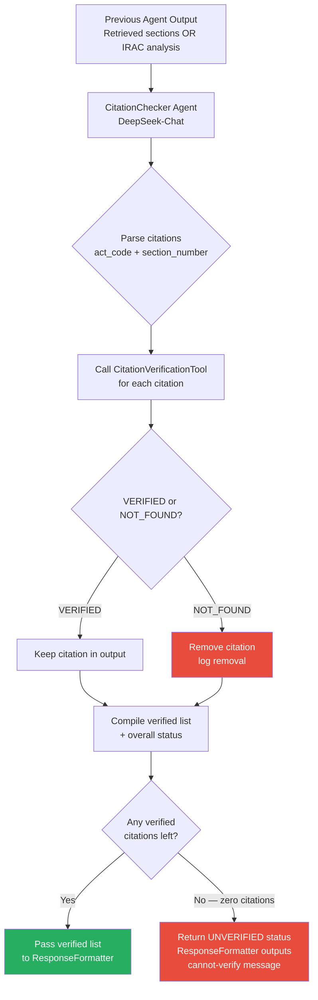
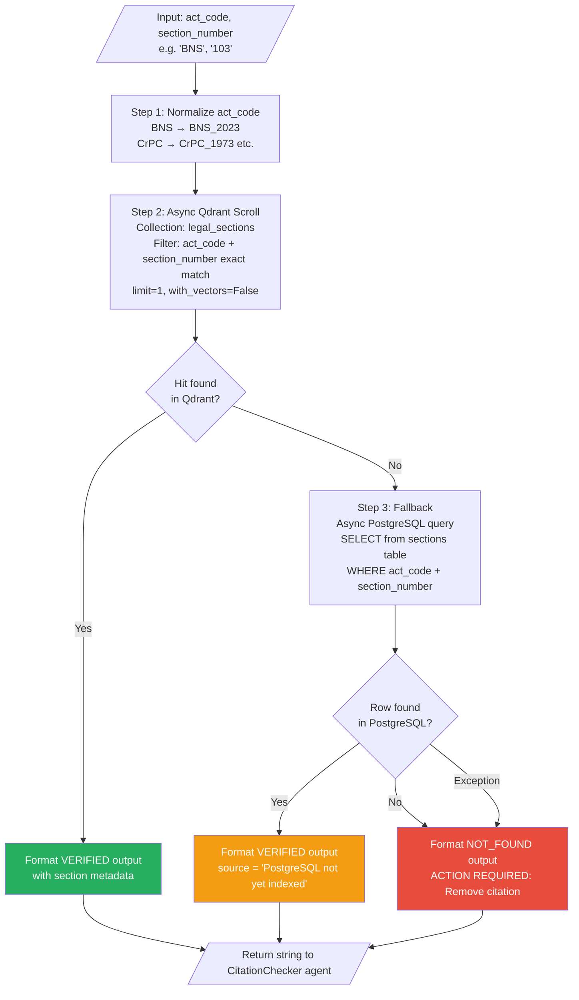

# Citation Verification Flow — Neethi AI

> **Core principle:** In legal, a wrong answer is worse than no answer.
> Citation verification is the final safety gate before any response reaches a user.

---

## 1. Where Verification Sits in Every Crew



**Rule enforced in `crew_config.py`:**
`CitationChecker` → `ResponseFormatter` — always this order, in every crew.
The formatter receives **only** what CitationChecker has approved.

---

## 2. Crew-by-Crew Pipeline

| Crew | Pipeline |
|------|----------|
| **Layman / Citizen** | QueryAnalyst → RetrievalSpecialist → **CitationChecker** → ResponseFormatter |
| **Lawyer** | QueryAnalyst → RetrievalSpecialist → LegalReasoner → **CitationChecker** → ResponseFormatter |
| **Legal Advisor** | QueryAnalyst → RetrievalSpecialist → LegalReasoner → **CitationChecker** → ResponseFormatter |
| **Police** | QueryAnalyst → RetrievalSpecialist → **CitationChecker** → ResponseFormatter |

---

## 3. CitationChecker Agent

The **CitationChecker** is a CrewAI agent (DeepSeek-Chat) whose only job is to:

1. Parse the previous agent's output for every `act_code + section_number` pair
2. Call `CitationVerificationTool` for each one
3. Mark each citation `VERIFIED` or `NOT_FOUND`
4. **Remove** every NOT_FOUND citation — never rename, renumber, or substitute
5. Pass the cleaned, verified list to ResponseFormatter



---

## 4. CitationVerificationTool — Internal Flow

This is what happens inside a single `CitationVerificationTool` call:



---

## 5. Qdrant Scroll — How the Lookup Works

Unlike the hybrid search (which uses dense + sparse vectors), citation verification uses a **metadata-only scroll** — no embedder, no vector math.

```
AsyncQdrantClient.scroll(
    collection_name = "legal_sections"        ← hardcoded collection
    scroll_filter = Filter(must=[
        FieldCondition("act_code",      MatchValue("BNS_2023")),
        FieldCondition("section_number", MatchValue("103")),
    ])
    limit = 1                                 ← only need existence check
    with_payload = True                       ← need metadata for output
    with_vectors = False                      ← skip vectors, faster
)
```

This is deterministic — either the section exists in the payload index or it doesn't. No scoring, no ranking, no embeddings involved.

---

## 6. VERIFIED Output Format

When a section is found, the tool returns a rich metadata block that the CitationChecker agent reads:

```
CITATION VERIFIED: BNS_2023 s.103
Status: VERIFIED (source: Qdrant indexed)

Section: 103 — Murder
Act: Bharatiya Nyaya Sanhita, 2023 (BNS_2023)
Era: naveen_sanhitas | Applicable from: 2024-07-01
Chapter: Chapter V — Of Offences Against The Human Body
Is Offence: Yes | Cognizable: Yes | Bailable: No | Court: Sessions
Text (preview): Whoever commits murder shall be punished with death or imprisonment...
```

---

## 7. NOT_FOUND Output Format

```
CITATION NOT VERIFIED: BNS_2023 s.302
Status: NOT_FOUND — section does not exist in database.
ACTION REQUIRED: Remove this citation from the response.
```

> **False-friend example:** An LLM might cite `BNS 302` for murder (because `IPC 302` = murder).
> But `BNS 302` = Religious Offences, not murder. `BNS 103` = murder.
> The NOT_FOUND result for a wrong section, and VERIFIED for the right one, is
> how the system catches this class of hallucination.

---

## 8. Overall Verification Status (CitationChecker Output)

After running all tool calls, the CitationChecker agent outputs one of:

| Status | Meaning |
|--------|---------|
| `VERIFIED` | All citations confirmed in database |
| `PARTIALLY_VERIFIED` | Some verified, some removed |
| `UNVERIFIED` | Zero citations survived — ResponseFormatter outputs cannot-verify message |

---

## 9. ResponseFormatter Safety Check

The ResponseFormatter is the last agent. Its task description in every crew contains:

```
CRITICAL FIRST CHECK: If the previous step's output contains
'NO_RELEVANT_DOCUMENTS_FOUND' or shows UNVERIFIED status with
zero verified citations, output ONLY the standard cannot-verify message.
Do NOT attempt to answer from your own knowledge.
```

This means even if the LLM "knows" the answer, it is instructed to refuse to respond without database-verified citations.

---

## 10. Hardcoded Values — Full Catalog

### `citation_verification_tool.py`

| Location | Value | Why hardcoded |
|----------|-------|---------------|
| `_ACT_CODE_ALIASES` dict inside `_run()` | `BNS → BNS_2023`, `BNSS → BNSS_2023`, `BSA → BSA_2023`, `IPC → IPC_1860`, `CRPC → CrPC_1973`, `IEA → IEA_1872` | Fixed set of supported acts — these are the only six acts indexed |
| `_act_code_to_name()` dict | Full names for the same 6 act codes | Display only — no logic dependency |
| `COLLECTION_LEGAL_SECTIONS` | Collection name `"legal_sections"` | Verification only checks statutory sections, never `sc_judgments` or `legal_sub_sections` |
| Qdrant scroll `limit=1` | Only fetches 1 result | Verification is an existence check — we don't need more |
| Qdrant `with_vectors=False` | Skips vector retrieval | No embedder needed for metadata lookup |
| Text preview `[:200]` chars | First 200 characters of section text | Enough for the agent to confirm context |
| PostgreSQL `pool_size=1, max_overflow=0` | Single connection per verification call | Prevents connection pool exhaustion from parallel citations |
| `chapter_title: None` in PostgreSQL result | Chapter not loaded from DB | Loaded via SQLAlchemy relationship which is skipped for performance |

### `crew_config.py` — CitationChecker task descriptions

| Crew | Hardcoded instruction |
|------|-----------------------|
| All crews | `act_code as 'BNS_2023', 'BNSS_2023', or 'BSA_2023' — never the short form` |
| Lawyer / Advisor | `Do NOT call CitationVerificationTool for non-BNS/BNSS/BSA laws (Companies Act, SEBI, CPC, IT Act)` |
| Lawyer / Advisor | `For SC judgment citations: label as 'SC JUDGMENT — cited as precedent' and retain` |
| Lawyer / Advisor | `If confidence drops below 0.5 after removing unverified citations, recommend consulting a lawyer` |
| Police | `Police acting on wrong section numbers is dangerous — verify all citations accurately` |

### `citation_checker.py` (agent)

| Value | Location |
|-------|----------|
| `max_iter=5` | CitationChecker gets more iterations than other agents — may need to verify multiple citations |
| `max_retry_limit=2` | LLM call retries |
| Model: `deepseek/deepseek-chat` | Chosen for structured verification, not speed |

---

## 11. What Is NOT Hardcoded

| Thing | Where it comes from |
|-------|---------------------|
| Section text, title, chapter | Qdrant payload / PostgreSQL — from ingested legal data |
| `is_offence`, `is_cognizable`, `is_bailable`, `triable_by` | Qdrant payload — set at index time per section |
| `era` (naveen_sanhitas / colonial_codes) | Qdrant payload |
| `applicable_from` date | Qdrant payload (e.g., `2024-07-01` for BNS/BNSS/BSA) |
| Qdrant URL + API key | `QDRANT_URL` / `QDRANT_API_KEY` env vars |
| PostgreSQL URL | `DATABASE_URL` env var |
| Which sections exist | Whatever is indexed — adding new acts requires no code change |

---

## 12. End-to-End Example (Layman Crew)

```
User query: "Someone slapped me. What law applies?"

QueryAnalyst
└── Classifies: criminal_substantive, BNS_2023, no old statutes

RetrievalSpecialist
└── Searches Qdrant: "hurt assault criminal force BNS voluntarily"
└── Returns: BNS_2023 s.117, s.118, s.131

CitationChecker
├── CitationVerificationTool("BNS_2023", "117")
│   └── Qdrant scroll → HIT → VERIFIED: Voluntarily causing hurt
├── CitationVerificationTool("BNS_2023", "118")
│   └── Qdrant scroll → HIT → VERIFIED: Voluntarily causing grievous hurt
└── CitationVerificationTool("BNS_2023", "131")
    └── Qdrant scroll → HIT → VERIFIED: Assault or criminal force
    └── Overall: VERIFIED (3/3)

ResponseFormatter
└── Receives verified list → formats citizen response
└── Citations section: only s.117, s.118, s.131 listed
└── Verification badge: ✓ VERIFIED
```
